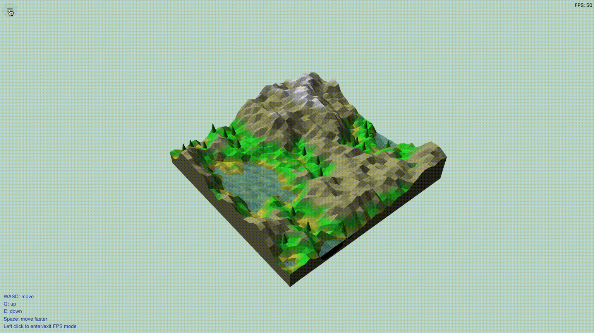

# 50.017 Graphics and Visualization Course Project: Procedural Terrain Generation
_Team 3: Low En (1003374), Elliot - Ezekiel Koh (1003501), Zachary Tan (1002859)_

## Screenshots




## How to Run:

This project is packaged as a [Next.js](https://nextjs.org/) web application. Node.js will be required to run this program locally.

### Using npm

Install dependencies

```
% npm install
```

Run the application locally

```
% npm run dev
```

### Using yarn

Install dependencies

```
% yarn
```

Run the application locally

```
% yarn dev
```

And then navigate to http://localhost:3000 on your web browser. Alternatively, open the deployed application [here](https://procedural-terrain-generation-webgl.vercel.app/)

## Notes

This directory has the following directory structure:

```
simple-server
|- node_modules
|- public           // contains assets like icons
|- pages						// contains the page layouts
|- src
|---- objects				// contains the various scene objects like the terrain mesh
|---- scene
|---- shaders
|---- utils					// useful utility functions
|---- webgl					// contains code that controls object loading and the render loop
```

